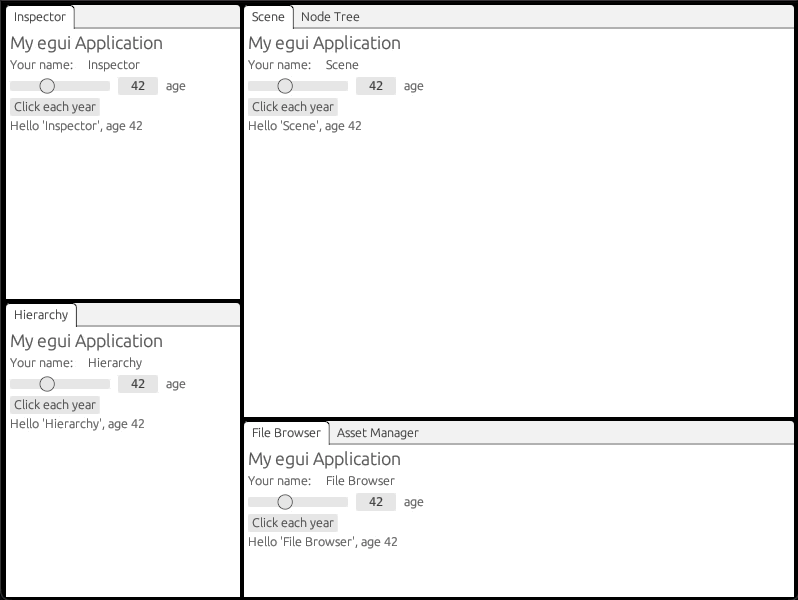

# `egui_dock`: docking system for [egui](https://github.com/emilk/egui)

[](https://github.com/Adanos020/egui_dock)
[](https://crates.io/crates/egui_dock)
[](https://docs.rs/egui_dock/)
[](https://github.com/emilk/egui)

Originally created by [@lain-dono](https://github.com/lain-dono), this library provides a docking system for `egui`.

> **This is a fork** of [anhosh/egui_dock](https://github.com/anhosh/egui_dock), carrying four
> patches on top of upstream `main`. Why it exists, what is patched, and how contributions work
> here (short version: AI-friendly, no vouch gate) — see [FORK.md](FORK.md).

## Contributing

Contributions are welcome here, on the terms described in [FORK.md](FORK.md) — read that first,
since it supersedes the upstream rules below for this fork.

The upstream [contribution guide](CONTRIBUTING.md) and [AI usage policy](AI_POLICY.md) are kept
in the tree as they are useful context and apply if you take your work to upstream instead.

This library is a collaborative project developed with direct involvement of its users.

Please feel free to open new issues and pull requests, and participate in discussions!
A lot of upstream's discussions take place on
[`egui`'s official Discord server](https://discord.gg/JFcEma9bJq), in the `#egui_dock` channel.

## Features

- Opening and closing tabs.
- Moving tabs between nodes and resizing.
- Dragging tabs out into new `egui` windows.
- Highly customizable look and feel.
- High degree of control over behaviour of the whole dock area and of individual tabs.
- Manipulating tabs and dock layout from code.

## Quick start

Add `egui` and `egui_dock` to your project's dependencies.

```toml
[dependencies]
egui = "0.35"
egui_dock = "0.20"
```

Then proceed by setting up `egui`, following its [quick start guide](https://github.com/emilk/egui#quick-start). Once
that's done, you can start using `egui_dock` – more details on that can be found in the
[documentation](https://docs.rs/egui_dock/latest/egui_dock/).

## Examples

The Git repository of this crate contains some example applications demonstrating how to achieve certain effects. You
can find all of them in the [`examples`](examples) folder.

You can run them with Cargo from the crate's root directory, for example: `cargo run --example hello`.

## Demo



## Alternatives

### [egui_tiles](https://github.com/rerun-io/egui_tiles)

It's a library aiming to achieve similar goals in addition to being more flexible and customizable.

One feature it supports that `egui_dock` does not at the moment is the ability to divide nodes into more than two
children, enabling horizontal, vertical, and grid layouts.

> [!NOTE]
> `egui_tiles` is much earlier in development than `egui_dock` and doesn't yet support a lot of features.
